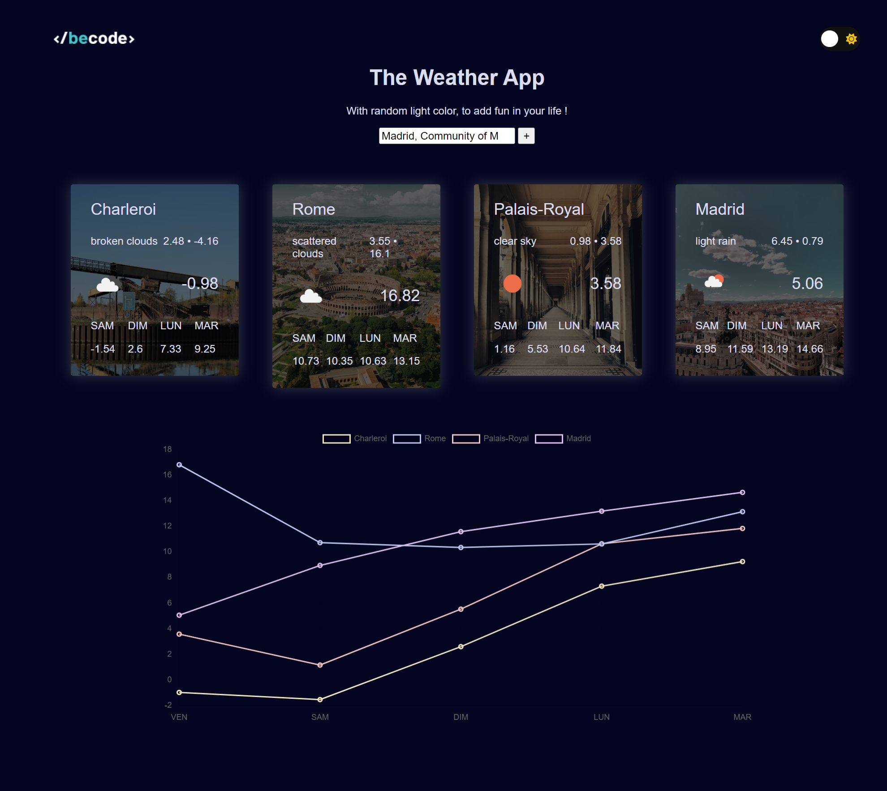
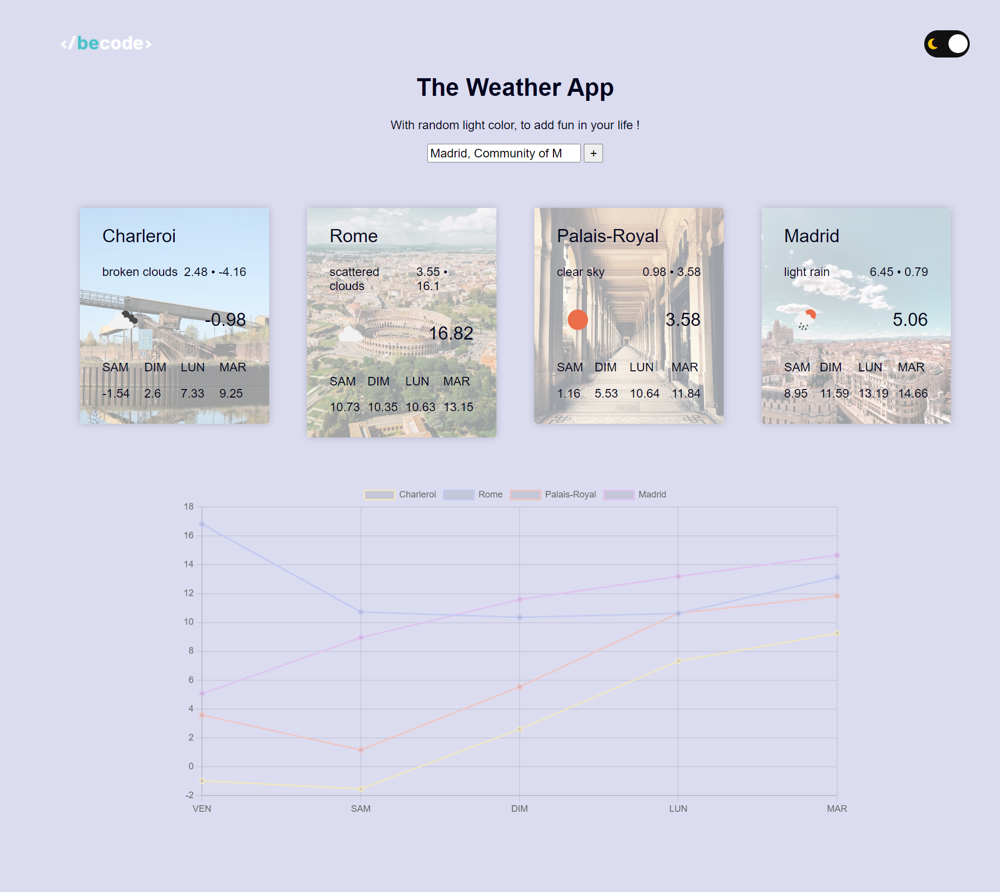

# Weather App
***
Le projet "Weather App" a pour objectif de créer une application web permettant à l'utilisateur de consulter la météo de la ville de son choix pour les cinq prochains jours.

## Table des matières
1. [Utilisation](#utilisation)
2. [Technologies](#technologies)
3. [Captures d'écran](#captures-décran)
4. [Améliorations futures](#ameliorations-futures)

### Utilisation
***
Pour utiliser l'application, suivez ces étapes :

1. Allez sur la page [WeatherApp](https://tess-mltx.github.io/weather-app/)
2. Entrez le nom de la ville dans la barre de recherche sur la page d'accueil.
3. La fonction d'autocomplétion suggère jusqu'à 10 villes existantes à mesure que vous tapez.
4. Cliquez sur le bouton "SUBMIT" ou appuyez sur ENTRÉE pour afficher la prévision météorologique pour les cinq prochains jours.
5. Explorez les fonctionnalités supplémentaires telles que la comparaison de la météo dans plusieurs villes et la visualisation des graphiques de température.

### Captures d'écran
***

## Technologies
***
Liste des technologies utilisées dans le projet :
* [SASS](https://sass-lang.com/)
* [OpenWeather API](https://home.openweathermap.org/): Version 3.0
* [Unsplash API](https://unsplash.com/developers)
* [CharJS](https://www.chartjs.org/docs/latest/)

## Améliorations futures
***
* Améliorer l'affichage des données.
* Refactor du code pour utiliser la classe qui a été ajoutée en fin de projet.
* Ajouter l'option de supression de card.
